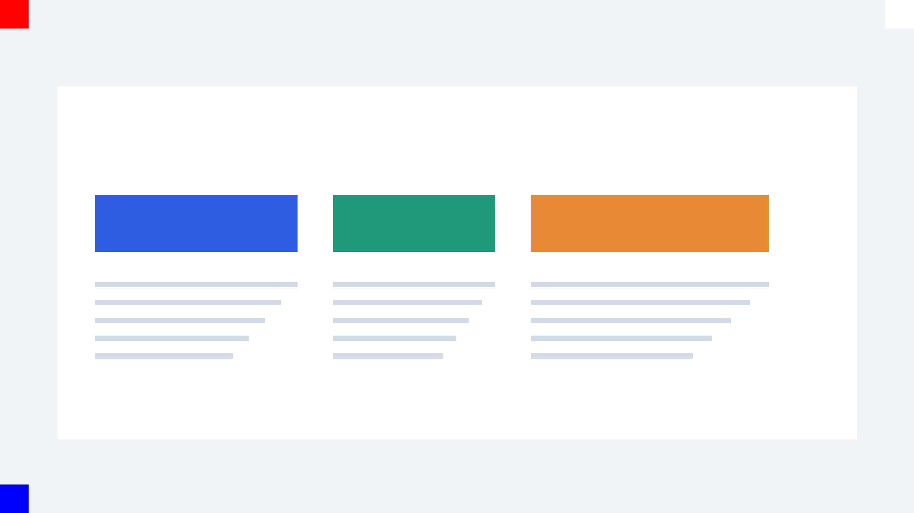
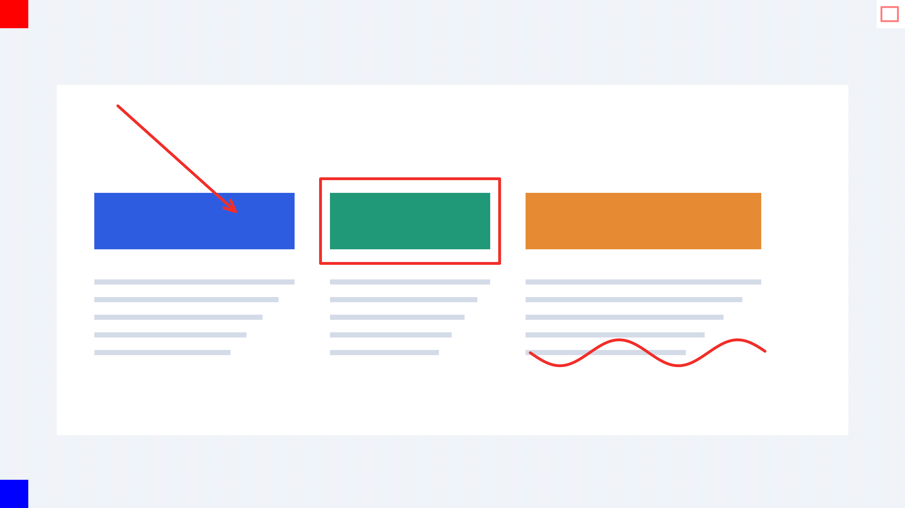
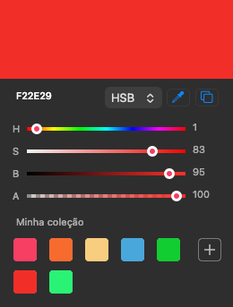
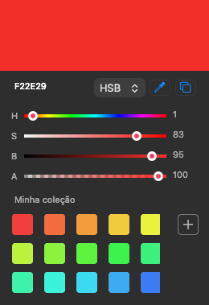

<p align="center">
  <strong>RXS</strong><br>
  Capture. Anote. Compartilhe.<br>
  Screenshots e anotações nativas para macOS, feitos em Rust.
</p>

<p align="center">
  
  
  <a href="LICENSE"></a>
  
</p>

RXS fica na barra de menus e abre um editor sob demanda para destacar o que importa em uma captura. A interface usa **AppKit e Core Graphics**, sem WebView, e a exportação preserva a resolução original da imagem.

[Recursos](#recursos) · [Compatibilidade](#compatibilidade) · [Instalação](#compilar-e-instalar) · [Atalhos](#atalhos-em-um-relance) · [Desenvolvimento](#testar) · [Validação](validation/README.md)

## Veja o resultado



*GIF alternando a imagem sintética original e o PNG produzido pelo diagnóstico nativo. Demonstra o resultado das ferramentas; não é uma gravação da interface nem de uma captura real. Os marcadores nos cantos verificam orientação e transparência.*

<details>
<summary>Ver o PNG exportado em resolução 4K</summary>



</details>

## Recursos

| Recurso | O que o RXS oferece |
| --- | --- |
| Captura nativa | Tela principal, região e janela pelo seletor do macOS |
| Anotações | Seta, retângulo sem preenchimento e desenho livre |
| Estilos | Cores com opacidade e traços de 2, 4, 8 ou 12 pixels |
| Seletor de cores | HEX, HSB/RGB, conta-gotas e coleção persistente |
| Histórico | Desfazer e refazer até 100 operações |
| Navegação | Ajustar à janela, 100%, zoom e rolagem |
| Exportação | Copiar PNG e salvar PNG na resolução original |
| Atalhos globais | Combinações configuráveis com detecção de conflitos |
| Proteção do trabalho | Confirmação antes de descartar uma versão não exportada |
| Integração com macOS | Barra de menus, diálogo nativo de salvar e Dock enquanto o editor está aberto |

### Cores à mão

<p>
  
  
</p>

*Imagens do componente real, geradas pelo diagnóstico com cores sintéticas.*

## Compatibilidade

| Plataforma ou formato | Suporte nesta versão |
| --- | --- |
| macOS 13+ | Alvo mínimo declarado; validação registrada em macOS 26.6.2 |
| Apple Silicon | Compilação e diagnóstico nativo validados |
| Mac Intel | Compilação para a arquitetura local prevista pelo script; validação em hardware pendente |
| Windows e Linux | Sem interface ou captura implementadas |
| PNG | Exportação para arquivo e clipboard, com transparência |
| Retina / múltiplos monitores | Coordenadas em pixels implementadas; validação física completa pendente |
| Distribuição | Compilação local com assinatura ad-hoc; sem Developer ID ou notarização |

**Estado do projeto:** versão 0.2.0. Captura real após conceder permissão, disparo dos atalhos globais e alguns fluxos do seletor de cores ainda têm validações manuais pendentes. Consulte o [relatório completo](validation/README.md) para separar o que foi implementado do que já foi testado.

Não estão implementados: gravação de vídeo/GIF, OCR, texto como anotação, blur/pixelização, recorte posterior, sincronização e biblioteca de imagens. O GIF deste README é material de documentação, não uma opção de exportação do app.

## Compilar e instalar

Requisitos: macOS 13+, Rust 1.88+ e Command Line Tools da Apple (`xcode-select --install`). A primeira compilação precisa das dependências do Cargo; as seguintes podem usar o cache.

```sh
git clone https://github.com/pedroaba/rxs.git
cd rxs
bash scripts/bundle.sh
open dist/RXS.app
```

O pacote fica em `dist/RXS.app`. Para uso diário, mova-o para `/Applications` ou `~/Applications` e abra dessa localização. Por padrão, o script cria uma assinatura ad-hoc para uso local. Como a identidade dessa assinatura muda junto com o executável, o macOS pode pedir novamente permissões de privacidade depois de cada recompilação ou atualização. Para assinar com uma identidade Developer ID disponível no Chaves e preservar a identidade do app entre versões, use `RXS_CODESIGN_IDENTITY="Developer ID Application: Seu Nome (TEAMID)" bash scripts/bundle.sh`. Distribuição pública também requer notarização. O script compila para a arquitetura do Mac atual. A validação inicial é em Apple Silicon; Intel ainda precisa de validação própria.

## Builds automáticos e releases

O [workflow de release](.github/workflows/release.yml) é acionado ao enviar uma tag de versão, como `v0.1.0` ou `v0.2.0-rc.1`. Ele executa formatação, Clippy e testes antes de compilar em runners macOS separados para **Apple Silicon (arm64)** e **Intel (x86_64)**. A release só é publicada quando os dois builds terminam e seus pacotes são verificados.

Os downloads ficam em [Releases](https://github.com/pedroaba/rxs/releases):

- `RXS-vX.Y.Z-macos-arm64.zip`: Macs com chip Apple Silicon.
- `RXS-vX.Y.Z-macos-x86_64.zip`: Macs Intel.
- Um arquivo `.sha256` para conferir cada ZIP.

Descompacte o ZIP da sua arquitetura e arraste **RXS.app** para **Aplicativos**. Os pacotes têm assinatura ad-hoc, **sem notarização da Apple**; o macOS pode bloquear a primeira abertura. Se você confia na origem do download, use **Ajustes do Sistema → Privacidade e Segurança → Abrir Mesmo Assim** após tentar abrir o app.

### Publicar uma versão

1. Atualize `version` em `Cargo.toml` e o registro do pacote `rxs` em `Cargo.lock` (execute `cargo check` para atualizar o lockfile).
2. Atualize `CFBundleShortVersionString` em `packaging/Info.plist` para a versão numérica correspondente e incremente `CFBundleVersion`. Para `0.2.0-rc.1`, a versão curta do bundle deve ser `0.2.0`.
3. Faça commit e envie as alterações, incluindo o workflow, para o GitHub.
4. Crie e envie a tag correspondente. Por exemplo, para a versão atual `0.1.0`:

```sh
git tag -a v0.1.0 -m "RXS 0.1.0"
git push origin v0.1.0
```

A tag deve corresponder exatamente à versão de `Cargo.toml`; versões com sufixo como `-rc.1` geram uma **pré-release**. Não é necessário configurar secrets: a publicação usa o `GITHUB_TOKEN` automático, com permissão de escrita apenas no job de release. O workflow aceita tags `vMAJOR.MINOR.PATCH` com pré-release opcional, sem metadados `+build`.

Acompanhe a execução em [Actions](https://github.com/pedroaba/rxs/actions/workflows/release.yml). Em caso de falha no upload, a release permanece como rascunho e uma reexecução pode concluí-la. Releases já publicadas não são sobrescritas: publique uma nova tag para uma nova versão. Os builds usam Rust 1.95.0; testes de interface e captura real continuam sujeitos às [validações manuais](validation/README.md).

## Primeiro uso e captura

1. Abra o RXS e encontre o ícone de enquadramento na barra de menus.
2. Para manter as teclas habituais, abra **Ajustes do Sistema → Teclado → Atalhos de Teclado → Capturas de Tela** e desative as ações do sistema que usam **Command+Shift+3** e **Command+Shift+4**. Preserve **Command+Shift+5**. O RXS não altera essas configurações automaticamente.
3. No menu do RXS, escolha **Atalhos…**, clique no controle da captura e pressione a combinação desejada. Clique em **Aplicar** para ativar. **Esc** cancela a gravação; **Tab** passa ao próximo controle. Se preferir, use `Command+Option+3` e `Command+Option+4` ou outras combinações com Command e Shift/Option/Control mais uma letra/número.
4. **Command+Shift+3** captura a tela principal. **Command+Shift+4** abre a seleção nativa: arraste uma região ou pressione espaço para escolher uma janela. **Escape** cancela. As mesmas ações estão no menu, incluindo captura direta de janela.
5. Se o macOS pedir permissão, autorize o RXS em **Privacidade e Segurança → Gravação de Tela** (o nome pode incluir áudio, conforme a versão do macOS), encerre o RXS e abra-o novamente. Se a chave já estiver ligada, desligue e ligue outra vez. Em builds ad-hoc atualizados, remova a entrada antiga e adicione a cópia atual do app.

O app verifica conflitos com atalhos do sistema e erros de registro. Ao alterar configurações no macOS, volte a **Atalhos… → Aplicar**. Os atalhos não são ativados antes dessa configuração. O atalho de tela inteira captura o monitor principal; região/janela podem ser selecionadas nos demais monitores. Se você mantiver Control pressionado no seletor nativo, o macOS pode enviar a captura diretamente ao clipboard, sem abrir o editor.

Toda captura concluída pelo RXS é copiada automaticamente em PNG e aberta no editor. O aviso **Imagem copiada** confirma o sucesso; depois de anotar, use **Copiar ⌘C** para atualizar o clipboard. Cancelar a captura não altera o clipboard.

Na janela de atalhos, conflitos aparecem junto ao controle. Os atalhos do RXS ficam temporariamente pausados enquanto você grava uma combinação; **Cancelar** mantém a configuração anterior. Os atalhos **⌘C** e **⌘S** do editor são fixos.

## Atalhos em um relance

| Ação | Atalho |
| --- | --- |
| Capturar tela principal | `⌘⇧3`, após configurar e liberar a combinação no macOS |
| Selecionar região / janela | `⌘⇧4`, após configurar; espaço alterna para janela |
| Cancelar seleção | `Esc` |
| Desfazer / refazer | `⌘Z` / `⌘⇧Z` |
| Copiar PNG | `⌘C` |
| Salvar PNG | `⌘S` |

Os atalhos de captura precisam ser ativados em **Atalhos…** no menu do RXS. Também é possível usar as ações do menu sem configurar atalhos.

## Anotar e exportar

- **Seta**, **Retângulo** sem preenchimento e **Livre**; seletor de cores flutuante com prévia, HEX, HSB/RGB, opacidade, conta-gotas, cópia do código e coleção persistente, e espessuras de 2, 4, 8 ou 12 pixels.
- Clique no botão de cor para abrir ou fechar o seletor; clique fora ou pressione **Escape** para fechar. As alterações valem para os próximos desenhos e não alteram o zoom. Use **+** em “Minha coleção” para salvar uma cor; as cores aparecem em uma grade de até três linhas, com rolagem vertical para coleções maiores. HEX aceita seis dígitos, com `#` opcional, preservando a opacidade.
- **Command+Z** desfaz e **Command+Shift+Z** refaz, até 100 operações. Anotações mais antigas permanecem na imagem, mas saem do histórico de desfazer.
- **Ajustar**, **100%**, **+**, **−** e rolagem para navegar. Os desenhos usam coordenadas da imagem e são exportados em sua resolução original, independentemente do zoom ou Retina.
- **Copiar / Command+C** copia PNG com as anotações. **Salvar PNG… / Command+S** abre o diálogo nativo e grava atomicamente no destino escolhido.
- Fechar ou substituir uma imagem ainda não exportada pede confirmação. Copiar ou salvar marca a versão atual como exportada; desenhar novamente volta a marcar como pendente.
- Imagens menores ficam centralizadas horizontal e verticalmente, inclusive ao ajustar o zoom ou redimensionar a janela.
- A captura usa o som nativo de screenshot do macOS, respeitando o volume do sistema.
- Enquanto o editor está aberto, o RXS aparece no Dock e no Command+Tab.
- Fechar o editor libera a imagem e remove seu arquivo temporário. O app continua na barra de menus. **Sair do RXS** encerra o processo.

## Organização

- `src/document.rs`: documento, geometria, estilos e histórico; sem tipos AppKit.
- `src/capture.rs`: fronteira de captura com sucesso, cancelamento e erro; o artefato temporário tem ciclo de vida explícito.
- `src/macos/`: AppKit, desenho Core Graphics, captura do sistema, atalhos, clipboard, exportação e diagnósticos.

Novas plataformas devem implementar captura e interface próprias reutilizando o núcleo. Não há gravação, biblioteca de imagens, sincronização, telemetria, consultas periódicas em repouso ou inicialização automática.

## Testar

```sh
cargo test --locked
cargo clippy --all-targets --locked -- -D warnings
cargo fmt --check
bash scripts/bundle.sh
dist/RXS.app/Contents/MacOS/rxs --diagnostics
```

Feche outra instância do RXS antes do diagnóstico. O modo `--diagnostics` gera uma imagem sintética 4K, valida orientação, transparência, coordenadas das anotações e roundtrip PNG em um clipboard privado. Também verifica a cópia automática e o estado de exportação, exercita o cancelamento da gravação de atalhos e gera imagens da janela de atalhos nas aparências clara e escura. Abre/exporta/fecha o editor 50 vezes e termina. Não captura sua tela, altera atalhos nem substitui o clipboard normal. Os arquivos ficam em `target/diagnostics/`; personalize com `RXS_DIAGNOSTICS_DIR`.

`--demo` abre uma imagem sintética no editor para inspeção manual, sem configurar atalhos. Este modo não cria uma captura real.

Metas iniciais em release: **50 MB em repouso** e **200 MB com uma imagem 3840×2160 aberta**. O relatório contém **physical footprint** e **RSS**, em MB decimais. São métricas distintas; memória do WindowServer e do processo temporário `screencapture` não está incluída. A resolução, o conteúdo, o número de desenhos e o clipboard de outros aplicativos afetam o consumo. Não há promessa de teto fixo para todas as cargas.

Os resultados medidos, o problema de retenção corrigido e as verificações que dependem de autorização no dispositivo estão no [relatório de validação](validation/README.md).

Para validação real, confira tela principal, região, janela, Escape, captura em monitor secundário, Retina, permissões negadas, conflitos, copiar/colar em outro app, salvar/cancelar/substituir arquivos, descarte, zoom e mudança de aparência. O diagnóstico sintético não substitui esses testes.

### Componente de cor

`src/macos/color_picker.rs` oferece `ColorPicker::new(mtm, rgba, callback)`, `set_color`, `open(anchor)`, `toggle(anchor)`, `close` e `is_open`. Os canais RGBA usam sRGB normalizado entre 0 e 1. `set_color` sincroniza a interface sem emitir o callback; alterações do usuário emitem o callback imediatamente. Chame `invalidate` quando a janela proprietária fechar, para descartar retornos pendentes do conta-gotas. O componente usa uma coleção compartilhada em `NSUserDefaults`, na chave `colorPickerPalette`.

As conversões e a serialização da paleta ficam em `src/color.rs`, sem dependências de AppKit. O diagnóstico também grava `color-picker.png` para inspeção visual.

## Perguntas frequentes

**O RXS envia minhas capturas para algum servidor?** Não há upload, sincronização ou telemetria implementados. As capturas temporárias são removidas ao fechar o editor; arquivos exportados ficam no destino que você escolheu.

**Posso experimentar sem capturar a tela?** Sim. Depois de compilar, execute `dist/RXS.app/Contents/MacOS/rxs --demo` para abrir uma imagem sintética no editor.

**Por que meu atalho não funciona?** Confira se a combinação ainda está reservada pelo macOS e reaplique a configuração em **Atalhos…**. Veja também a permissão de Gravação de Tela nas configurações do sistema.

**Os números de memória são uma garantia?** Não. O [relatório](validation/README.md) descreve medições sintéticas, diferenças entre physical footprint e RSS e limitações da carga usada.

## Contribuir

Sugestões e relatos de problemas são bem-vindos em [Issues](https://github.com/pedroaba/rxs/issues). Inclua versão do macOS, arquitetura, passos para reproduzir e resultado esperado. Ao anexar capturas, remova informações pessoais.

Para contribuir com código, crie um fork, faça uma alteração focada e execute os comandos da seção [Testar](#testar). Em mudanças de interface ou captura, descreva também as verificações manuais realizadas. Abra um pull request com o problema resolvido e a validação feita.

## Licença

Distribuído sob a [licença MIT](LICENSE).
